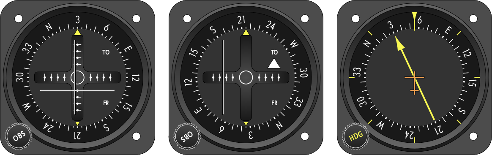

AviaTikZ
========

This is a LaTeX package for drawing aircraft cockpit instruments. It is
intended to support flight instructors for preparing educational material.

**CAUTION:** This project is work in progress.

Showcase
--------

### Standard Six Pack

### Radio Navigation

